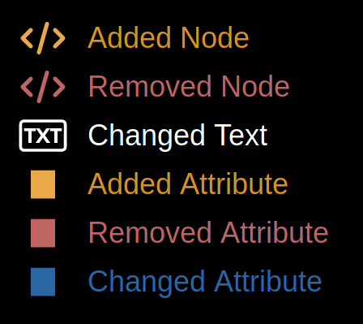
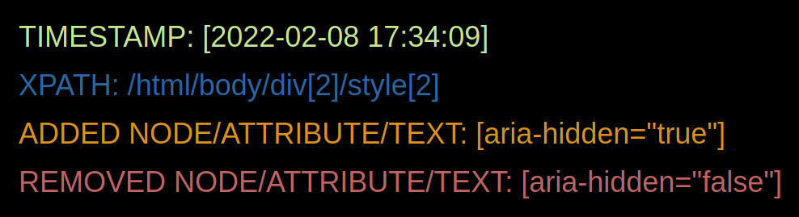

# DOM-changes-logger 

> DOM-changes-logger uses MutationObservers to detect every changes in a web page DOM and produce an html log file

## Using DOM-changes-logger

_DOM-changes-logger requires Node 14 LTS (14.x) or later._

**Installation**:

```sh
npm install
```

**Run it**: 

```sh
node DOM-changes-logger.js 'https://www.google.com/'
```

**Icons**:

.


**Messages**:


